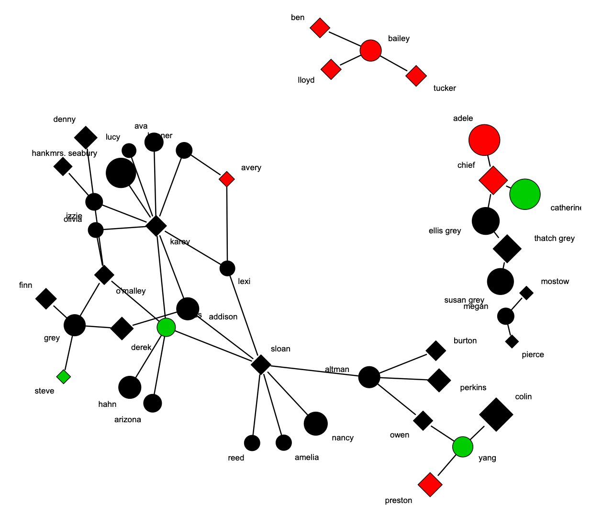
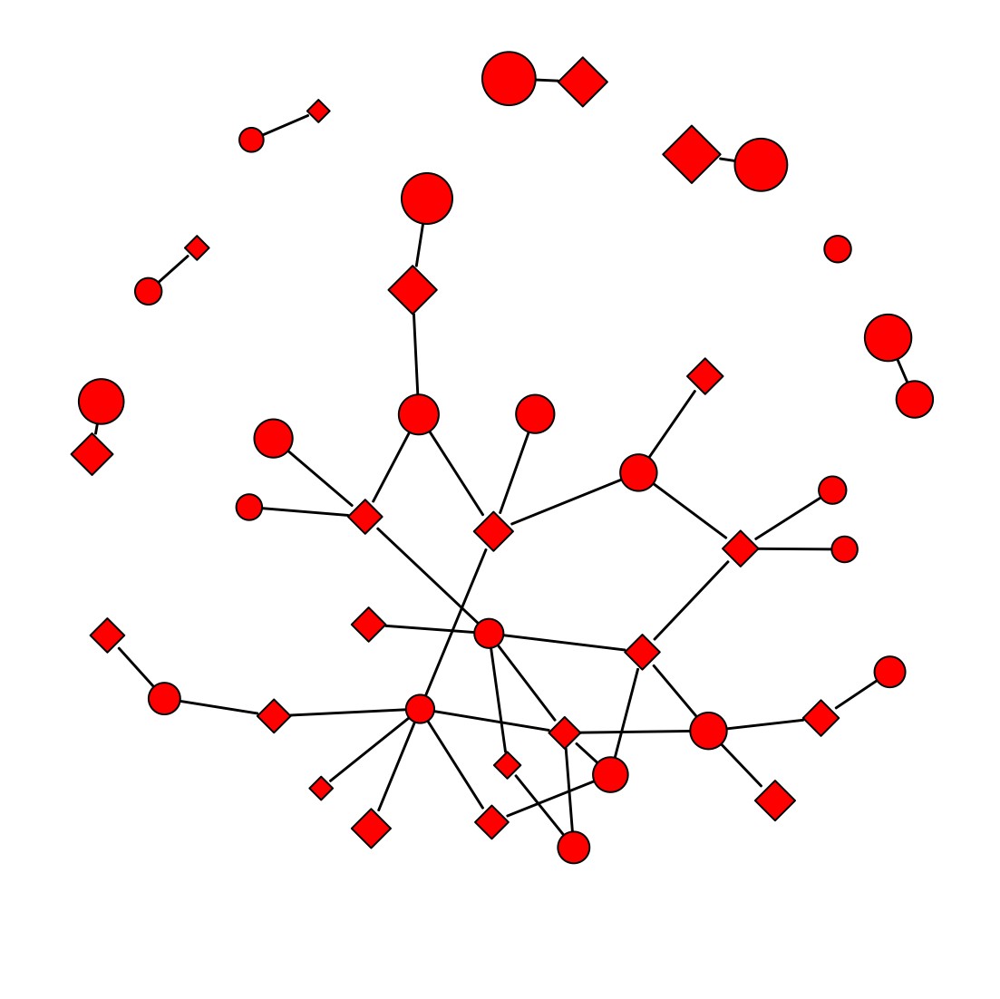
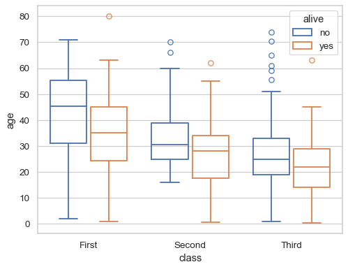
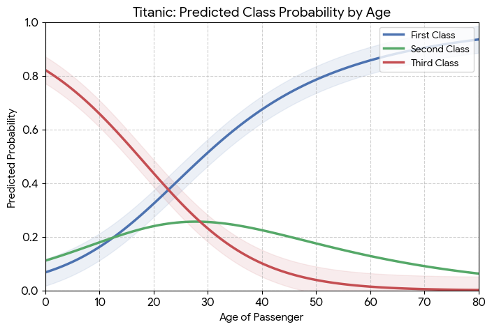

```{r setup, include=FALSE}
knitr::opts_chunk$set(echo = TRUE)
```

## visualization benefits
*Why* do we visualize?

- enhanced memory
- simplification 
- improved clarity

## visualization aims
*When* do we visualize?

- exploratory
- conceptual
- explanatory

## visualization principles
*How* do we visualize?

- reduce dimensionality
    - information > ink
    - signal > noise
- reproducibility
- **retain ethical protections**
- provide interpretive clarity
    - *theoretical* focus

## visualization practices

*What* do we visualize?

**standard approach**

- obtain & preprocess
- **\textcolor{red}{visualize}** to describe
- analyze
- explain via layering

## visualization practices

*What* do we visualize?

:::: {.columns}
::: {.column}
**standard approach**

- obtain & preprocess
- **\textcolor{red}{visualize}** to describe
- analyze
- explain via layering
:::
::: {.column}
**proposed approach**

- obtain & preprocess
- analyze
- **\textcolor{blue}{visualize}** to explain
:::
::::

## a trivial example
:::::::::::::: {.columns}
::: {.column width="50%"}

:::
::: {.column width="50%"}

:::
::::::::::::::
<sub><sup>adapted from [\textcolor{blue}{Benjamin Lind}](https://badhessian.org/2012/09/lessons-on-exponential-random-graph-modeling-from-greys-anatomy-hook-ups/)</sup></sub>


## a parallel logic
:::::::::::::: {.columns}
::: {.column width="50%"}

:::
::: {.column width="50%"}


:::
::::::::::::::
<sub><sup>adapted from [\textcolor{blue}{Michael Waskom}](https://seaborn.pydata.org/generated/seaborn.boxplot.html)</sup></sub>

## visualization principles

                    observed                  modeled    
----------------    ----------                -------
explore/describe    \checkmark                **\textcolor{red}{x}**
simplify            **\textcolor{red}{?}**    \checkmark
reproduce           \checkmark                \checkmark   
confidentiality     **\textcolor{red}{x}**    \checkmark   
explain/theory      **\textcolor{red}{?}**    \checkmark   

::: notes
Rather than dichotomous, this should be thought of as an optimization task, w/ variable potential success.
:::

## the provocation
*for some use-cases*, presenting **modeled network visualizations** better optimizes our **aims** than observed network data

- focuses on *theoretical* contributions over empirical case idiosyncrasies
- maintains ethical protections
  - enhanced replicability?
- **NOTE**: this isn't *entirely* new (e.g., block images, motifs)


let's discuss! [\textcolor{red}{jimi.adams@sc.edu}](mailto:jimi.adams@sc.edu)

